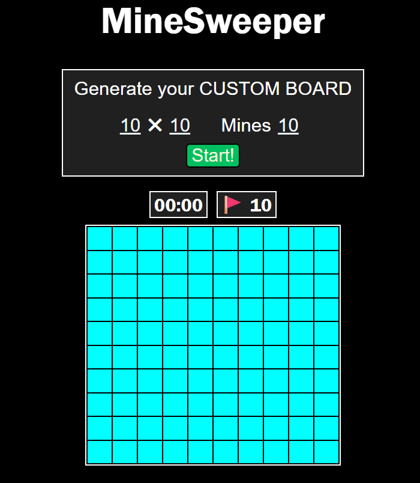

# MineSweeper

"Minesweeper game created using HTML,CSS, Javascript"

Author: Sayan Mandal

Minesweeper is a popular puzzle game originally created by Microsoft. To read more about it click [here](https://en.wikipedia.org/wiki/Minesweeper_(video_game)#History).

## Game Rules



- Left Click on a tile: If there is a bomb present on the tile, then the game ends. Otherwise, the number of bombs around the tile is revealed.
- Right Click on a tile: This puts a flag on the tile and helps in keeping note of tiles with bomb.

## Features

1. You can generate a custom board with dimensions ranging from 0x0 to 40x40 and could set the number of mines.
2. The time taken starting from the first click till when the game ends is displayed continuously.
3. The number of mine-flags left to deploy is also displayed.

## Instructions to Run

1. Clone the repository:
    ```bash
    git clone <https://github.com/SayanMandal1001/Minesweeper.git>
    ```
2. Open the 'main.html' file in your browser.